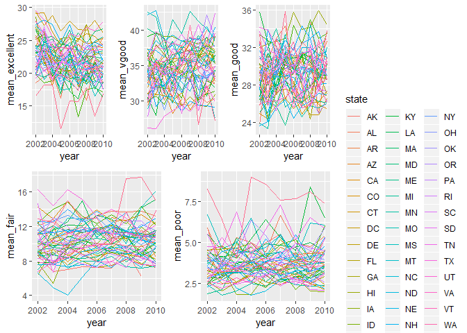

p8105\_hw3\_ph2538
================
Pei Yang Hsieh
2018-10-7

The purpose of this file is to complete homework
    3.

``` r
library(tidyverse)
```

    ## -- Attaching packages --------------------------------------------------------------------- tidyverse 1.2.1 --

    ## v ggplot2 3.0.0     v purrr   0.2.5
    ## v tibble  1.4.2     v dplyr   0.7.6
    ## v tidyr   0.8.1     v stringr 1.3.1
    ## v readr   1.1.1     v forcats 0.3.0

    ## -- Conflicts ------------------------------------------------------------------------ tidyverse_conflicts() --
    ## x dplyr::filter() masks stats::filter()
    ## x dplyr::lag()    masks stats::lag()

``` r
library(ggplot2)
library(devtools)
library(p8105.datasets)
library(knitr)
library(patchwork)
library(ggridges)
```

    ## 
    ## Attaching package: 'ggridges'

    ## The following object is masked from 'package:ggplot2':
    ## 
    ##     scale_discrete_manual

## Problem 1

### Loading and cleaning brfss data

``` r
#First, do some data cleaning:
#format the data to use appropriate variable names;
#focus on the “Overall Health” topic
#include only responses from “Excellent” to “Poor”
#organize responses as a factor taking levels from “Excellent” to “Poor”

data(brfss_smart2010)

clean_brfss =
  brfss_smart2010 %>%
  janitor::clean_names() %>%
  filter(topic == "Overall Health") %>%
  filter(response == "Excellent" | response == "Very good" | response == "Good" | response == "Fair" | response == "Poor") %>%
  select(year, locationdesc, response, data_value) %>%
  mutate(response = as.factor(response)) %>%
  spread(key = response, value = data_value) %>%
  separate(locationdesc, into = c("state", "county"), sep = " - ")
```

### Question 1-4 for Problem 1

Using this dataset, do or answer the following (commenting on the
results of each):

1.  In 2002, which states were observed at 7 locations?

2.  Make a “spaghetti plot” that shows the number of observations in
    each state from 2002 to 2010.

3.  Make a table showing, for the years 2002, 2006, and 2010, the mean
    and standard deviation of the proportion of “Excellent” responses
    across locations in NY State.

4.  For each year and state, compute the average proportion in each
    response category (taking the average across locations in a state).
    Make a five-panel plot that shows, for each response category
    separately, the distribution of these state-level averages over
    time.

<!-- end list -->

``` r
#In 2002, which states were observed at 7 locations?

brfss_2002 = filter(clean_brfss, year == '2002') %>%
  distinct(state, county) %>%
  count(state) %>%
  filter(n == 7)

brfss_2002
```

    ## # A tibble: 3 x 2
    ##   state     n
    ##   <chr> <int>
    ## 1 CT        7
    ## 2 FL        7
    ## 3 NC        7

1.  Connecticut, Florida, and North Carolina are observed at 7
    locations.

<!-- end list -->

``` r
#Make a “spaghetti plot” that shows the number of observations in each state from 2002 to 2010.

#count number of observations in each state
brfss_plot = clean_brfss %>%
  distinct(year, state, county) %>% 
  select(year,  state, county) %>% 
  group_by(year, state) %>%
  mutate(count = n())

#create plot
  ggplot(brfss_plot, aes(x = year, y = count, color = state)) +
  geom_point() + geom_line()
```

<!-- -->

``` r
#Make a table showing, for the years 2002, 2006, and 2010, the mean and standard deviation of the proportion of “Excellent” responses across locations in NY State.

#the following takes mean and standard deviation by year, combining all NY counties in each year.
brfss_excellent = clean_brfss %>%
  filter(year == '2002' | year == '2006' | year == '2010') %>%
  filter(state == 'NY') %>%
  select(year, county, Excellent) %>%
  group_by(year) %>%
  summarize(sd_excellent = sd(Excellent), mean_excellent = mean(Excellent)) # %>%
  #spread(key = county, value = mean_excellent) %>%
  #knitr::kable(digits = 1)

brfss_excellent
```

    ## # A tibble: 3 x 3
    ##    year sd_excellent mean_excellent
    ##   <int>        <dbl>          <dbl>
    ## 1  2002         4.49           24.0
    ## 2  2006         4.00           22.5
    ## 3  2010         3.57           22.7

``` r
#For each year and state, compute the average proportion in each response category (taking the average across locations in a state). Make a five-panel plot that shows, for each response category separately, the distribution of these state-level averages over time.

five_panel_plot = clean_brfss %>%
  group_by(year, state) %>%
  summarize(mean_excellent = mean(Excellent), mean_vgood = mean(`Very good`), mean_good = mean(Good), mean_fair = mean(Fair), mean_poor = mean(Poor))

plot_exc = ggplot(five_panel_plot, aes(x = year, y = mean_excellent, color = state)) + 
  geom_line() +
  theme(legend.position = "none")

plot_vgood = ggplot(five_panel_plot, aes(x = year, y = mean_vgood, color = state)) + 
  geom_line() +
  theme(legend.position = "none")

plot_good = ggplot(five_panel_plot, aes(x = year, y = mean_good, color = state)) + 
  geom_line() +
  theme(legend.position = "none")

plot_fair = ggplot(five_panel_plot, aes(x = year, y = mean_fair, color = state)) + 
  geom_line() +
  theme(legend.position = "none")

plot_poor = ggplot(five_panel_plot, aes(x = year, y = mean_poor, color = state)) + 
  geom_line()

(plot_exc + plot_vgood + plot_good) / (plot_fair + plot_poor)
```

    ## Warning: Removed 3 rows containing missing values (geom_path).

    ## Warning: Removed 2 rows containing missing values (geom_path).
    
    ## Warning: Removed 2 rows containing missing values (geom_path).

    ## Warning: Removed 1 rows containing missing values (geom_path).
    
    ## Warning: Removed 1 rows containing missing values (geom_path).

<!-- -->

## Problem 2

``` r
#load instacart data
data(instacart)
```

## Problem 3

``` r
#load ny_noaa data
data(ny_noaa)
```
