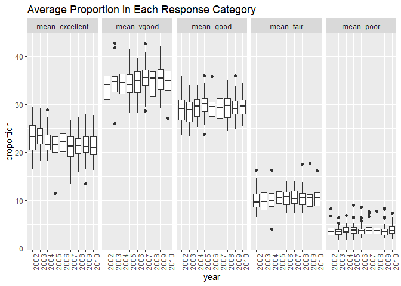

p8105\_hw3\_ph2538
================
Pei Yang Hsieh
2018-10-13

The purpose of this file is to complete homework 3.

## Problem 1

### Loading and cleaning brfss data

``` r
#First, do some data cleaning:
#format the data to use appropriate variable names;
#focus on the “Overall Health” topic
#include only responses from “Excellent” to “Poor”
#organize responses as a factor taking levels from “Excellent” to “Poor”

data(brfss_smart2010)

clean_brfss =
  brfss_smart2010 %>%
  janitor::clean_names() %>%
  filter(topic == "Overall Health") %>%
  filter(response == "Excellent" | response == "Very good" | response == "Good" | response == "Fair" | response == "Poor") %>%
  select(year, locationdesc, response, data_value) %>%
  mutate(response = as.factor(response)) %>%
  spread(key = response, value = data_value) %>%
  separate(locationdesc, into = c("state", "county"), sep = " - ")
```

### Question 1-4 for Problem 1

Using this dataset, do or answer the following (commenting on the
results of each):

1.  In 2002, which states were observed at 7 locations?

2.  Make a “spaghetti plot” that shows the number of observations in
    each state from 2002 to 2010.

3.  Make a table showing, for the years 2002, 2006, and 2010, the mean
    and standard deviation of the proportion of “Excellent” responses
    across locations in NY State.

4.  For each year and state, compute the average proportion in each
    response category (taking the average across locations in a state).
    Make a five-panel plot that shows, for each response category
    separately, the distribution of these state-level averages over
    time.

<!-- end list -->

``` r
#In 2002, which states were observed at 7 locations?

brfss_2002 = 
  filter(clean_brfss, year == '2002') %>%
  distinct(state, county) %>%
  count(state) %>%
  filter(n == 7)

brfss_2002
```

    ## # A tibble: 3 x 2
    ##   state     n
    ##   <chr> <int>
    ## 1 CT        7
    ## 2 FL        7
    ## 3 NC        7

1.  In 2002, Connecticut, Florida, and North Carolina are observed at 7
    locations.

<!-- end list -->

``` r
#Make a “spaghetti plot” that shows the number of locations in each state from 2002 to 2010.

#count number of locations in each state
brfss_plot = 
  clean_brfss %>%
  distinct(year, state, county) %>% 
  select(year,  state, county) %>% 
  group_by(year, state) %>%
  mutate(count = n())

#create plot
  ggplot(brfss_plot, aes(x = year, y = count, color = state)) +
  geom_point() + 
  geom_line() +
  labs(
    title = "Number of Locations in Each State 2002-2010",
    x = "Year",
    y = "Number of Locations"
  )
```

<!-- -->

2.  This spaghetti plot shows the number of locations in each state from
    2002 to 2010. Most of the states have under 10 locations The state
    with the highest count (over 40 locations) has 2 peaks, in 2007 and
    2010.

<!-- end list -->

``` r
#Make a table showing, for the years 2002, 2006, and 2010, the mean and standard deviation of the proportion of “Excellent” responses across locations in NY State.

#the following takes mean and standard deviation by year, combining all NY counties in each year.
brfss_excellent = clean_brfss %>%
  filter(year == '2002' | year == '2006' | year == '2010') %>%
  filter(state == 'NY') %>%
  select(year, county, Excellent) %>%
  group_by(year) %>%
  summarize(mean_excellent = mean(Excellent), sd_excellent = sd(Excellent))

brfss_excellent
```

    ## # A tibble: 3 x 3
    ##    year mean_excellent sd_excellent
    ##   <int>          <dbl>        <dbl>
    ## 1  2002           24.0         4.49
    ## 2  2006           22.5         4.00
    ## 3  2010           22.7         3.57

3.  In 2002, 2006, and 2010, the mean of the proportion of excellent is
    24, 22.5, and 22.7 respectively.The standard deviation of the
    proportion is 4.49, 4, and 3.57 respectively. The means and standard
    deviations in all three years are similar to each
other.

<!-- end list -->

``` r
#For each year and state, compute the average proportion in each response category (taking the average across locations in a state). Make a five-panel plot that shows, for each response category separately, the distribution of these state-level averages over time.

five_panel_plot = clean_brfss %>%
  mutate(year = as.factor(year)) %>% 
  group_by(year, state) %>%
  summarize(mean_excellent = mean(Excellent), mean_vgood = mean(`Very good`), mean_good = mean(Good), mean_fair = mean(Fair), mean_poor = mean(Poor)) %>%
  gather(key = response, value = proportion, mean_excellent:mean_poor) %>% 
  mutate(response_f = factor(response, levels = c('mean_excellent', 'mean_vgood', 'mean_good', 'mean_fair', 'mean_poor')))
  
ggplot(five_panel_plot, aes(x = year, y = proportion)) + 
  geom_boxplot() + 
  facet_grid(. ~ response_f) +
  theme(axis.text.x = element_text(angle = 90)) + 
  labs(
    title = "Average Proportion in Each Response Category"
  )
```

    ## Warning: Removed 21 rows containing non-finite values (stat_boxplot).

<!-- -->

4.  The plot shows that the distribution of state level averages over
    time in each response category remains relatively consistent over
    the years. Out of the response categories, very good has the highest
    average proportion, followed by good, excellent, fair, and then
    poor.

## Problem 2

``` r
#load instacart data
data(instacart)

instacart
```

    ## # A tibble: 1,384,617 x 15
    ##    order_id product_id add_to_cart_ord~ reordered user_id eval_set
    ##       <int>      <int>            <int>     <int>   <int> <chr>   
    ##  1        1      49302                1         1  112108 train   
    ##  2        1      11109                2         1  112108 train   
    ##  3        1      10246                3         0  112108 train   
    ##  4        1      49683                4         0  112108 train   
    ##  5        1      43633                5         1  112108 train   
    ##  6        1      13176                6         0  112108 train   
    ##  7        1      47209                7         0  112108 train   
    ##  8        1      22035                8         1  112108 train   
    ##  9       36      39612                1         0   79431 train   
    ## 10       36      19660                2         1   79431 train   
    ## # ... with 1,384,607 more rows, and 9 more variables: order_number <int>,
    ## #   order_dow <int>, order_hour_of_day <int>,
    ## #   days_since_prior_order <int>, product_name <chr>, aisle_id <int>,
    ## #   department_id <int>, aisle <chr>, department <chr>

The dimensions of the instacart dataset is1384617, 15, which means that
it has 1384617 observations and 15 variables. Some key variables include
order ID, product ID, and user ID which are all integers. There is also
the product name, aisle, department, and department ID, which give
information on the products and where they are found. Additionally,
variables include time and day of the orders. For example, Bulgarian
Yogurt was ordered from the yogurt aisle, which is aisle 120. The yogurt
aisle is under the dairy eggs department, which is department 16. Also,
it shows that the user ordered this Bulgarian Yogurt on Thursday at 10 o
clock.

### Questions for Problem 2

1.  How many aisles are there, and which aisles are the most items
    ordered from?

2.  Make a plot that shows the number of items ordered in each aisle.
    Order aisles sensibly, and organize your plot so others can read it.

3.  Make a table showing the most popular item in each of the aisles
    “baking ingredients”, “dog food care”, and “packaged vegetables
    fruits”

4.  Make a table showing the mean hour of the day at which Pink Lady
    Apples and Coffee Ice Cream are ordered on each day of the week;
    format this table for human readers (i.e. produce a 2 x 7
table).

<!-- end list -->

``` r
#How many aisles are there, and which aisles are the most items ordered from?

length(unique(instacart$aisle_id))
```

    ## [1] 134

``` r
length(unique(instacart$aisle))
```

    ## [1] 134

1a. There are 134 unique aisles.

``` r
aisle_max = 
  instacart %>%
  group_by(aisle_id) %>%
  summarize(n = n()) %>% 
  arrange(desc(n))

name_aisle_max = 
  instacart %>%
  group_by(aisle) %>%
  summarize(n = n()) %>% 
  arrange(desc(n))
```

1b. Aisle 83 (fresh vegetables) has most items ordered from it, followed
by aisle 24 (fresh
fruits).

``` r
#Make a plot that shows the number of items ordered in each aisle. Order aisles sensibly, and organize your plot so others can read it.
 
aisle_max %>% 
  mutate(aisle_id = as.factor(aisle_id)) %>% 
  mutate(aisle_id = forcats::fct_reorder(aisle_id, n)) %>% 
  ggplot(aes(x = aisle_id, y = n)) +
  geom_bar(stat = "identity") +
  labs(
    title = "Number of Items per Aisle",
    x = "Aisle ID",
    y = "Number of Items"
  ) +
  scale_x_discrete(breaks = c(132, 42, 83))
```

<!-- -->

``` r
name_aisle_max %>% 
  mutate(aisle = as.factor(aisle)) %>% 
  mutate(aisle = forcats::fct_reorder(aisle, n)) %>% 
  ggplot(aes(x = aisle, y = n)) + 
  geom_bar(stat = "identity") +
  labs(
    title = "Number of Items per Aisle",
    x = "Aisle Name",
    y = "Number of Items"
  ) +
  scale_x_discrete(breaks = c("beauty", "fresh vegetables"))
```

<!-- -->

2.  These two plots show number of items ordered in each aisle, from
    aisles with the least number of items (beauty, aisle 132) to those
    with the most (fresh vegetables, aisle 83). The first plot shows the
    aisle ID and the second plot shows the aisle names. Both the plots
    show that the range of number of items ordered in each aisle goes up
    to around 150,000
items.

<!-- end list -->

``` r
#Make a table showing the most popular item in each of the aisles “baking ingredients”, “dog food care”, and “packaged vegetables fruits”

popular_item = 
  instacart %>% 
  filter(aisle == "baking ingredients" | aisle == "dog food care" | aisle == "packaged vegetables fruits") %>% 
  select(aisle, product_name) %>% 
  group_by(aisle, product_name) %>% 
  summarize(n = n()) %>% 
  arrange(desc(n))
  
popular_item_sort = 
  popular_item %>%
  group_by(aisle) %>% 
  top_n(1) %>% 
  knitr::kable(digits = 1)
```

    ## Selecting by n

``` r
popular_item_sort
```

| aisle                      | product\_name                                 |    n |
| :------------------------- | :-------------------------------------------- | ---: |
| packaged vegetables fruits | Organic Baby Spinach                          | 9784 |
| baking ingredients         | Light Brown Sugar                             |  499 |
| dog food care              | Snack Sticks Chicken & Rice Recipe Dog Treats |   30 |

3.  This table shows that the most popular item from the “packaged
    vegetables fruits” aisle is the Organic Baby Spinach with 9784
    orders. For “baking ingredients”, the most popular item is Light
    Brown Sugar with 499 orders. For “dog food care”, the most popular
    item is Snack Sticks Chicken & Rice Recipe Dog Treats with 30
    orders. This shows that Organic Baby Spinach is ordered many more
    times than the other two most popular items in the other two
aisles.

<!-- end list -->

``` r
#Make a table showing the mean hour of the day at which Pink Lady Apples and Coffee Ice Cream are ordered on each day of the week; format this table for human readers (i.e. produce a 2 x 7 table).

apple_icecream = 
  instacart %>% 
  filter(product_name == "Pink Lady Apples" | product_name == "Coffee Ice Cream") %>% 
  group_by(product_name, order_dow) %>% 
  summarize(mean_hour = mean(order_hour_of_day)) %>% 
  spread(key = product_name, value = mean_hour) %>% 
  mutate(order_dow = recode(order_dow, `0` = "Sunday", `1` = "Monday", `2` = "Tuesday", `3` = "Wednesday", `4` = "Thursday", `5` = "Friday", `6` = "Saturday")) %>%
   knitr::kable(digits = 1)
  
apple_icecream
```

| order\_dow | Coffee Ice Cream | Pink Lady Apples |
| :--------- | ---------------: | ---------------: |
| Sunday     |             13.8 |             13.4 |
| Monday     |             14.3 |             11.4 |
| Tuesday    |             15.4 |             11.7 |
| Wednesday  |             15.3 |             14.2 |
| Thursday   |             15.2 |             11.6 |
| Friday     |             12.3 |             12.8 |
| Saturday   |             13.8 |             11.9 |

4.  This table shows that the mean hour of the day for ordering coffee
    ice cream and pink lady apples is generally midday. The mean hours
    are comparable across weekdays for both items. For coffee ice cream,
    on average, people order at the latest time on Tuesday. For pink
    lady apples, on average. people order at the latest time on
    Wednesday.

## Problem 3

``` r
#load ny_noaa data
#Do some data cleaning. Create separate variables for year, month, and day. Ensure observations for temperature, precipitation, and snowfall are given in reasonable units. 

data(ny_noaa)

clean_noaa = 
  ny_noaa %>% 
  janitor::clean_names() %>%
  separate(date, into = c("year", "month", "day"), sep = "-") %>% 
  mutate(
    prp = prcp/10,
    tmax = as.numeric(tmax)/10,
    tmin = as.numeric(tmin)/10
  )
```

### Questions for Problem 3

1.  For snowfall, what are the most commonly observed values? Why?
2.  Make a two-panel plot showing the average max temperature in January
    and in July in each station across years. Is there any observable /
    interpretable structure? Any outliers?
3.  Make a two-panel plot showing (i) tmax vs tmin for the full dataset
    (note that a scatterplot may not be the best option); and (ii) make
    a plot showing the distribution of snowfall values greater than 0
    and less than 100 separately by year.

<!-- end list -->

``` r
#For snowfall, what are the most commonly observed values? Why?

clean_noaa %>% 
  group_by(snow) %>% 
  summarize(n = n()) %>% 
  top_n(5)
```

    ## Selecting by n

    ## # A tibble: 5 x 2
    ##    snow       n
    ##   <int>   <int>
    ## 1     0 2008508
    ## 2    13   23095
    ## 3    25   31022
    ## 4    51   18274
    ## 5    NA  381221

1.  0 is the most commonly observed value. This suggests that for the
    majority of the year, most days have no
snowfall.

<!-- end list -->

``` r
#Make a two-panel plot showing the average max temperature in January and in July in each station across years. Is there any observable / interpretable structure? Any outliers?

plot_max_temp = 
  clean_noaa %>% 
  filter(month == "01" | month == "07") %>%
  na.omit() %>% 
  mutate(tmax = as.numeric(tmax)) %>% 
  group_by(year, month, id) %>% 
  summarize(mean_tmax = mean(tmax)) %>% 
  ggplot(aes(x = year, y = mean_tmax)) + 
  geom_boxplot() + facet_grid(. ~ month) +
  labs(
    title = "Average Max Temp (°C) in January and July 1981-2010",
    x = "Year",
    y = "Average Max Temperature (°C)"
  ) +
  theme(axis.text.x = element_text(angle = 90), text = element_text(size = 8))

plot_max_temp 
```

<!-- -->

2.  This two-panel plot shows that the average max temperature in July
    is always higher than that of January (around 30°C compared to 0°C).
    Regarding structure, for January, there is slight variability in
    average max temp over the years. July’s average max temp remains
    mostly consistent over the years. Also, there are a few outliers in
    every year for January, which fall both above and below the average
    max temperature. There are fewer outliers in July, and most of these
    outliers fall below the average max
temperature.

<!-- end list -->

``` r
#Make a two-panel plot showing (i) tmax vs tmin for the full dataset (note that a scatterplot may not be the best option); and (ii) make a plot showing the distribution of snowfall values greater than 0 and less than 100 separately by year.

tmax_tmin_plot = 
  clean_noaa %>% 
  na.omit() %>% 
  ggplot(aes(x = tmin, y = tmax)) + 
  geom_hex() +
  labs(
    title = "Minimum Temperature vs Max temperature",
    x = "Minimum Temperature",
    y = "Max Temperature"
  ) +
  theme(axis.text.x = element_text(angle = 90), text = element_text(size = 8))
  
snowfall_distribution = 
  clean_noaa %>% 
  na.omit() %>% 
  filter(snow > 0 & snow < 100) %>%
  ggplot(aes(x = year, y = snow)) + 
  geom_boxplot() +
  labs(
    title = "Distribution of snowfall",
    x = "Year",
    y = "Snow"
  ) +
  theme(axis.text.x = element_text(angle = 90), text = element_text(size = 8))

tmax_tmin_plot + snowfall_distribution
```

<!-- -->

3.  For minimum vs maximum temperature, a linear trend is visible, shown
    in the lighter blue counts. For distribution of snowfall, there are
    only a few outliers over the years, all of which are higher values.
    Snowfall distribution remains relatively consistent over the years,
    shown by how the means are very similar to each other.
