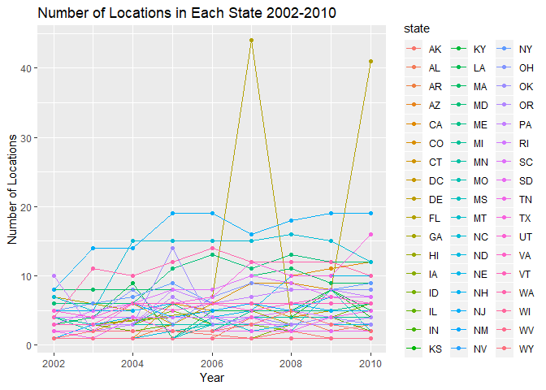
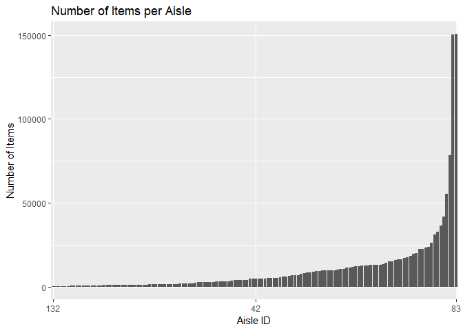

p8105\_hw3\_ph2538
================
Pei Yang Hsieh
2018-10-7

The purpose of this file is to complete homework
    3.

``` r
library(tidyverse)
```

    ## -- Attaching packages --------------------------------------------------------------------- tidyverse 1.2.1 --

    ## v ggplot2 3.0.0     v purrr   0.2.5
    ## v tibble  1.4.2     v dplyr   0.7.6
    ## v tidyr   0.8.1     v stringr 1.3.1
    ## v readr   1.1.1     v forcats 0.3.0

    ## -- Conflicts ------------------------------------------------------------------------ tidyverse_conflicts() --
    ## x dplyr::filter() masks stats::filter()
    ## x dplyr::lag()    masks stats::lag()

``` r
library(ggplot2)
library(devtools)
library(p8105.datasets)
library(knitr)
library(patchwork)
library(ggridges)
```

    ## 
    ## Attaching package: 'ggridges'

    ## The following object is masked from 'package:ggplot2':
    ## 
    ##     scale_discrete_manual

## Problem 1

### Loading and cleaning brfss data

``` r
#First, do some data cleaning:
#format the data to use appropriate variable names;
#focus on the “Overall Health” topic
#include only responses from “Excellent” to “Poor”
#organize responses as a factor taking levels from “Excellent” to “Poor”

data(brfss_smart2010)

clean_brfss =
  brfss_smart2010 %>%
  janitor::clean_names() %>%
  filter(topic == "Overall Health") %>%
  filter(response == "Excellent" | response == "Very good" | response == "Good" | response == "Fair" | response == "Poor") %>%
  select(year, locationdesc, response, data_value) %>%
  mutate(response = as.factor(response)) %>%
  spread(key = response, value = data_value) %>%
  separate(locationdesc, into = c("state", "county"), sep = " - ")
```

### Question 1-4 for Problem 1

Using this dataset, do or answer the following (commenting on the
results of each):

1.  In 2002, which states were observed at 7 locations?

2.  Make a “spaghetti plot” that shows the number of observations in
    each state from 2002 to 2010.

3.  Make a table showing, for the years 2002, 2006, and 2010, the mean
    and standard deviation of the proportion of “Excellent” responses
    across locations in NY State.

4.  For each year and state, compute the average proportion in each
    response category (taking the average across locations in a state).
    Make a five-panel plot that shows, for each response category
    separately, the distribution of these state-level averages over
    time.

<!-- end list -->

``` r
#In 2002, which states were observed at 7 locations?

brfss_2002 = filter(clean_brfss, year == '2002') %>%
  distinct(state, county) %>%
  count(state) %>%
  filter(n == 7)

brfss_2002
```

    ## # A tibble: 3 x 2
    ##   state     n
    ##   <chr> <int>
    ## 1 CT        7
    ## 2 FL        7
    ## 3 NC        7

1.  Connecticut, Florida, and North Carolina are observed at 7
    locations.

<!-- end list -->

``` r
#Make a “spaghetti plot” that shows the number of observations in each state from 2002 to 2010.

#count number of observations in each state
brfss_plot = clean_brfss %>%
  distinct(year, state, county) %>% 
  select(year,  state, county) %>% 
  group_by(year, state) %>%
  mutate(count = n())

#create plot
  ggplot(brfss_plot, aes(x = year, y = count, color = state)) +
  geom_point() + geom_line()
```

<!-- -->

``` r
#Make a table showing, for the years 2002, 2006, and 2010, the mean and standard deviation of the proportion of “Excellent” responses across locations in NY State.

#the following takes mean and standard deviation by year, combining all NY counties in each year.
brfss_excellent = clean_brfss %>%
  filter(year == '2002' | year == '2006' | year == '2010') %>%
  filter(state == 'NY') %>%
  select(year, county, Excellent) %>%
  group_by(year) %>%
  summarize(sd_excellent = sd(Excellent), mean_excellent = mean(Excellent)) # %>%
  #spread(key = county, value = mean_excellent) %>%
  #knitr::kable(digits = 1)

brfss_excellent
```

    ## # A tibble: 3 x 3
    ##    year sd_excellent mean_excellent
    ##   <int>        <dbl>          <dbl>
    ## 1  2002         4.49           24.0
    ## 2  2006         4.00           22.5
    ## 3  2010         3.57           22.7

``` r
#For each year and state, compute the average proportion in each response category (taking the average across locations in a state). Make a five-panel plot that shows, for each response category separately, the distribution of these state-level averages over time.

# five_panel_plot = clean_brfss %>%
#   group_by(year, state) %>%
#   summarize(mean_excellent = mean(Excellent), mean_vgood = mean(`Very good`), mean_good = mean(Good), mean_fair = mean(Fair), mean_poor = mean(Poor))
# 
# plot_exc = ggplot(five_panel_plot, aes(x = year, y = mean_excellent, color = state)) + 
#   geom_line() +
#   theme(legend.position = "none")
# 
# plot_vgood = ggplot(five_panel_plot, aes(x = year, y = mean_vgood, color = state)) + 
#   geom_line() +
#   theme(legend.position = "none")
# 
# plot_good = ggplot(five_panel_plot, aes(x = year, y = mean_good, color = state)) + 
#   geom_line() +
#   theme(legend.position = "none")
# 
# plot_fair = ggplot(five_panel_plot, aes(x = year, y = mean_fair, color = state)) + 
#   geom_line() +
#   theme(legend.position = "none")
# 
# plot_poor = ggplot(five_panel_plot, aes(x = year, y = mean_poor, color = state)) + 
#   geom_line()
# 
# (plot_exc + plot_vgood + plot_good) / (plot_fair + plot_poor)
# 

five_panel_plot = clean_brfss %>%
  group_by(year, state) %>%
  summarize(mean_excellent = mean(Excellent), mean_vgood = mean(`Very good`), mean_good = mean(Good), mean_fair = mean(Fair), mean_poor = mean(Poor)) %>%
gather(key = response, value = proportion, mean_excellent:mean_poor) 
  
ggplot(five_panel_plot, aes(x = year, y = proportion, color = state)) + geom_point() + facet_grid(. ~ response)
```

    ## Warning: Removed 21 rows containing missing values (geom_point).

<!-- -->

``` r
#NEED TO ORDER THESE 
```

## Problem 2

``` r
#load instacart data
data(instacart)

instacart
```

    ## # A tibble: 1,384,617 x 15
    ##    order_id product_id add_to_cart_ord~ reordered user_id eval_set
    ##       <int>      <int>            <int>     <int>   <int> <chr>   
    ##  1        1      49302                1         1  112108 train   
    ##  2        1      11109                2         1  112108 train   
    ##  3        1      10246                3         0  112108 train   
    ##  4        1      49683                4         0  112108 train   
    ##  5        1      43633                5         1  112108 train   
    ##  6        1      13176                6         0  112108 train   
    ##  7        1      47209                7         0  112108 train   
    ##  8        1      22035                8         1  112108 train   
    ##  9       36      39612                1         0   79431 train   
    ## 10       36      19660                2         1   79431 train   
    ## # ... with 1,384,607 more rows, and 9 more variables: order_number <int>,
    ## #   order_dow <int>, order_hour_of_day <int>,
    ## #   days_since_prior_order <int>, product_name <chr>, aisle_id <int>,
    ## #   department_id <int>, aisle <chr>, department <chr>

The goal is to do some exploration of this dataset. To that end, write a
short description of the dataset, noting the size and structure of the
data, describing some key variables, and giving illstrative examples of
observations.

The dimensions of the instacart dataset is1384617, 15, which means that
it has 1384617 observations and 15 variables. Some key variables include
order ID, product ID, and user ID which are all integers. There is also
the product name, aisle, department, and department ID, which give
information on the products and where they are found.

### Questions for Problem 2

1.  How many aisles are there, and which aisles are the most items
    ordered from?

2.  Make a plot that shows the number of items ordered in each aisle.
    Order aisles sensibly, and organize your plot so others can read it.

3.  Make a table showing the most popular item aisles “baking
    ingredients”, “dog food care”, and “packaged vegetables fruits”

4.  Make a table showing the mean hour of the day at which Pink Lady
    Apples and Coffee Ice Cream are ordered on each day of the week;
    format this table for human readers (i.e. produce a 2 x 7
table).

<!-- end list -->

``` r
#How many aisles are there, and which aisles are the most items ordered from?

length(unique(instacart$aisle_id))
```

    ## [1] 134

``` r
#there are 134 unique aisles

aisle_max = 
  instacart %>%
  group_by(aisle_id) %>%
  summarize(n = n()) 

#sort by items sold
arrange(aisle_max, desc(n))
```

    ## # A tibble: 134 x 2
    ##    aisle_id      n
    ##       <int>  <int>
    ##  1       83 150609
    ##  2       24 150473
    ##  3      123  78493
    ##  4      120  55240
    ##  5       21  41699
    ##  6      115  36617
    ##  7       84  32644
    ##  8      107  31269
    ##  9       91  26240
    ## 10      112  23635
    ## # ... with 124 more rows

``` r
#Aisle 83 (fresh vegetables) has most items ordered from it, followed by aisle 24 (fresh fruits).
```

1.  There are 134 unique aisles.

2.  Aisle 83 (fresh vegetables) has most items ordered from it, followed
    by aisle 24 (fresh
fruits).

<!-- end list -->

``` r
#Make a plot that shows the number of items ordered in each aisle. Order aisles sensibly, and organize your plot so others can read it.

ggplot(aisle_max, aes(x = aisle_id, y = n)) + 
  geom_point() +
  labs(
    title = "Number of Items per Aisle",
    x = "Aisle ID",
    y = "Number of Items"
  ) 
```

<!-- -->

``` r
#reorder this plot with highest number of items first, to lowest 
```

``` r
#Make a table showing the most popular item aisles “baking ingredients”, “dog food care”, and “packaged vegetables fruits”

popular_item = 
  instacart %>% 
  filter(aisle == "baking ingredients" | aisle == "dog food care" | aisle == "packaged vegetables fruits") %>% 
  select(aisle, product_name) %>% 
  group_by(aisle, product_name) %>% 
  summarize(n = n()) %>% 
  arrange(desc(n))
  
popular_item_sort = 
  popular_item %>%
  group_by(aisle) %>% 
  top_n(5) %>% 
  spread(key = aisle, value = product_name)
```

    ## Selecting by n

``` r
#min_rank(n)
#separate 
```

``` r
#Make a table showing the mean hour of the day at which Pink Lady Apples and Coffee Ice Cream are ordered on each day of the week; format this table for human readers (i.e. produce a 2 x 7 table).

apple_icecream = 
  instacart %>% 
  filter(product_name == "Pink Lady Apples" | product_name == "Coffee Ice Cream") %>% 
  group_by(product_name, order_dow) %>% 
  summarize(mean_hour = mean(order_hour_of_day)) %>% 
  spread(key = product_name, value = mean_hour) %>% 
  mutate(order_dow = recode(order_dow, `0` = "Sunday", `1` = "Monday", `2` = "Tuesday", `3` = "Wednesday", `4` = "Thursday", `5` = "Friday", `6` = "Saturday"))
```

## Problem 3

``` r
#load ny_noaa data
data(ny_noaa)
```
